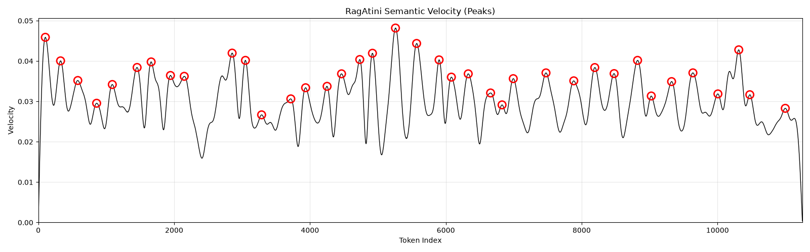
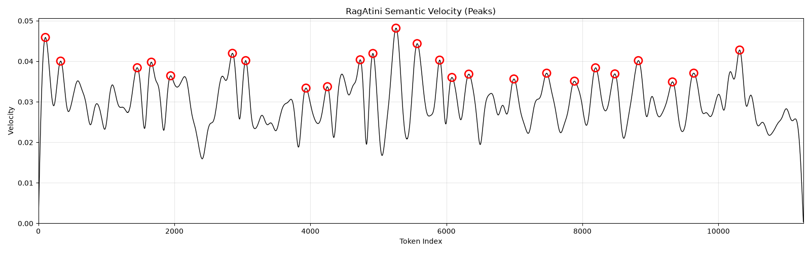
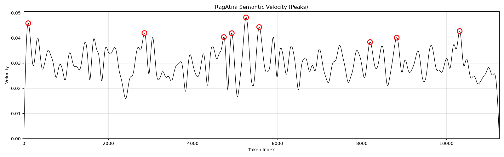
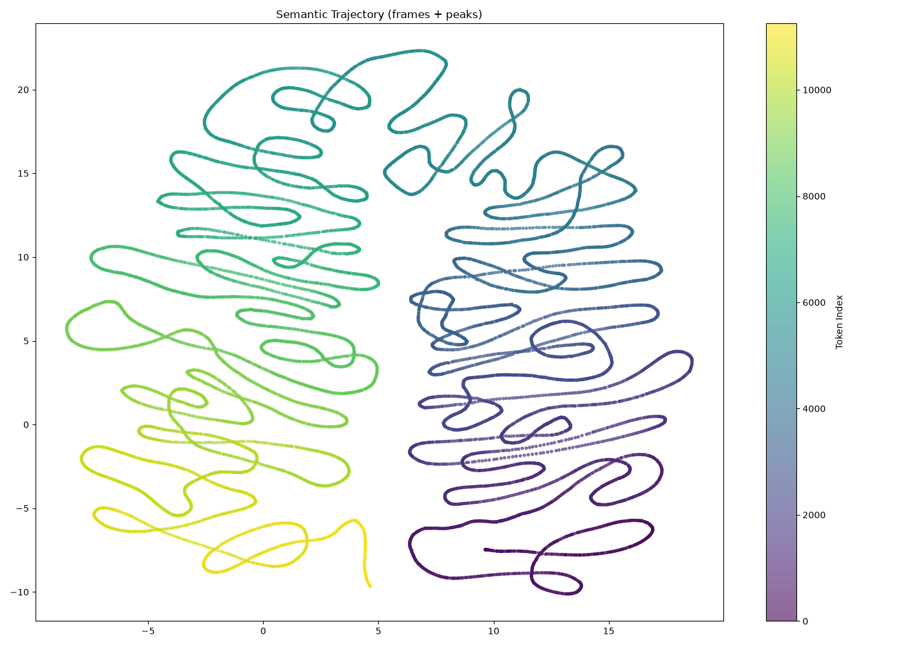

# RagAtini

A document chunker that cuts where the *meaning* changes, not where the
character count runs out.

Most chunkers split on length or punctuation — they have no idea what the text is
about. RagAtini reads the document through a transformer and watches how the
meaning drifts from one token to the next. Where the meaning turns a corner, it
cuts. Then it nudges each cut onto a real sentence or paragraph boundary so nothing
breaks mid-thought.

The chunks come out coherent, boundary-aligned, and verbatim — each one is an exact
slice of the source text.

## The idea

The method leans on an emergent property of BERT-style encoders that they were
never explicitly trained for.

When you run a document through a model like `modernbert-embed`, you get one vector
per token. These models are trained so that text with similar *meaning* lands in
similar places in vector space. The side effect: as you read along a document, the
sequence of token vectors traces a *path* through meaning space. While the topic
holds steady, consecutive vectors sit close together — the path moves slowly. When
the topic shifts, consecutive vectors jump apart — the path lurches.

Nobody trained the model to mark section boundaries. But because it learned to
place similar meanings near each other, the *speed* at which its vectors move
becomes a signal for where the meaning changes. We call that speed **semantic
velocity**: the distance between each token's vector and the one before it. Topic
boundaries show up as spikes in velocity, and that emergent signal is what RagAtini
cuts on.

A practical wrinkle: long documents don't fit in one context window, so the per-token
vectors are built by running overlapping windows and **meshing** them — averaging
each token's vector across every window that saw it. That gives one continuous,
stable vector per token across an arbitrarily long document, so the velocity curve
is smooth end-to-end rather than resetting at every window edge.

### How it runs

1. **Embed & mesh** — run overlapping windows through the embedding model and mesh
   the per-token vectors into one continuous sequence.
2. **Smooth & measure** — Gaussian-smooth the sequence, then compute semantic
   velocity (the norm of the difference between consecutive vectors). The smoothing
   width is set by `f_sig`.
3. **Find the turns** — detect peaks in the velocity curve. A peak is a candidate
   cut. How sharp a peak must be is set by `prominence`.
4. **Snap to language** — move each cut onto the nearest real sentence/paragraph
   boundary using the `chonky` neural splitter, so chunks never break mid-sentence.

Steps 1–2 are the expensive part and they run **once**. Steps 3–4 are cheap, which
is what makes re-chunking at a different granularity nearly free — see
[`.to()`](#re-chunking-without-re-embedding).

## Install

```bash
pip install -r requirements.txt
```

The `chonky` boundary splitter downloads its model from the Hugging Face hub on
first use. The plotting extras (`umap-learn`, `scikit-learn`, `matplotlib`) are only
needed if you use `charts.py`.

## Quick start

```python
import torch
from transformers import AutoTokenizer, AutoModel
from RagAtini import RagAtini

device = "cuda" if torch.cuda.is_available() else "cpu"

model_name = "nomic-ai/modernbert-embed-base"
tokenizer = AutoTokenizer.from_pretrained(model_name)
model = AutoModel.from_pretrained(model_name).to(device)

ragatini = RagAtini(model, tokenizer)

with open("document.txt") as f:
    document = f.read()

response = ragatini.vectorize(document, f_sig=0.5, prominence=0.5)

for seg in response.segments:
    start, end = seg.text_coords
    print(f"[{start}:{end}] {seg.text[:80]}...")
```

Every `seg.text` is exactly `document[start:end]`. No paraphrasing, no
reconstruction — you can take the coords straight back to the source.

## Interface

### `RagAtini(model, tokenizer, max_chunk_length=None, doc_prefix="search_document: ")`

Wraps an embedding model and its tokenizer.

- `max_chunk_length` — window size for embedding. Defaults to the tokenizer's
  `model_max_length`.
- `doc_prefix` — prepended to each window before embedding. Use whatever prefix your
  embedding model expects (nomic uses `"search_document: "`).

### `vectorize(document, *, f_sig=1.0, prominence=0.5, overlap=False, min_chunk_size=100, ...) -> RagAtiniResponse`

Runs the full pipeline and returns a response holding the chunks.

| param | default | what it does |
|---|---|---|
| `f_sig` | `1.0` | Smoothing width for the velocity curve. **Lower = finer chunks** (less smoothing, more peaks survive). `1.0` gives large sections, `0.5` is a good balance, `0.25` gives fine passages. |
| `prominence` | `0.5` | How sharply a velocity peak must rise above its surroundings to count as a cut. **Higher = fewer, coarser cuts.** |
| `overlap` | `False` | If `True`, each chunk reaches one boundary past its cut on each side. Only worth it at fine granularity, where it bridges evidence split across small chunks. |
| `min_chunk_size` | `100` | Minimum chunk length in characters. Slivers merge into their neighbour. |

### `RagAtiniResponse`

| attribute | description |
|---|---|
| `.segments` | The chunks, in document order. Each is a `RagAtiniTextSegment` with `.text` (the verbatim slice) and `.text_coords` (`(start_char, end_char)`). |
| `.peaks` | Token indices of the velocity peaks used as cuts. |
| `.prominence`, `.overlap`, `.min_chunk_size` | The settings this response was built with. |

### Re-chunking without re-embedding

The expensive embedding pass happens once, inside `vectorize`. To get a *different*
granularity from that same pass, call `.to()` on the response. It re-detects peaks
and rebuilds the chunks, but reuses the cached velocity curve — so it's effectively
instant:

```python
response = ragatini.vectorize(document, f_sig=0.5)   # embeds once

coarse = response.to(prominence=2.0)   # a handful of large sections
fine   = response.to(prominence=0.1)   # many small passages
```

`.to()` returns a **fresh** response and never mutates the original, so you can hold
several granularities side by side (handy for building a hierarchy):

```python
levels = [response.to(prominence=p) for p in (0.1, 0.5, 2.0)]
```

`.to()` adjusts `prominence`, `overlap`, and `min_chunk_size`. It does **not** change
`f_sig` — the smoothing width reshapes the velocity curve itself, so a different
`f_sig` needs a new `vectorize` call.

## Picking the knobs

`f_sig` and `prominence` both control granularity but from different directions:
`f_sig` reshapes the curve (how much detail survives smoothing), `prominence` sets
the bar for which peaks on that curve become cuts.

A few notes from practice:

- **`prominence` around 0.5** is a sensible default for general chunking.
- **Push `prominence` up for coarser sections** (2.0 gives clean section-level
  chunks on a typical paper). Going much higher — say **4.0 — gets very coarse**: on
  prose-heavy documents the only peaks that survive are the violent ones where tables
  jar against text, so a long stretch of prose stays as a single large chunk next to
  finely-cut tables. For *flat* chunking that's usually too aggressive; for a
  **hierarchy** it's useful — that large prose chunk is a clean *parent* node, and a
  finer pass (lower `prominence`) subdivides it into children. Because every level
  draws cuts from the same boundary pool, the fine cuts nest cleanly inside the
  coarse ones, forming a real containment tree:

  ```python
  response = ragatini.vectorize(document, f_sig=0.5)
  parent   = response.to(prominence=4.0)   # coarse parent sections
  children = response.to(prominence=0.5)   # nest inside the parents
  ```
- **Drop `f_sig` for finer chunks** when you want tight, topically-pure passages
  (e.g. 0.25). Pair it with `overlap=True` if evidence tends to straddle the cuts.

## Visualizing

`charts.py` plots the velocity curve and the semantic trajectory. It takes plain
arrays, so it has no dependency on the model:

```python
from charts import peak_velocity_chart, umap_chart_2d

velocity = response._request.velocity.cpu().numpy()
vectors  = response._request.vectors.cpu().numpy()   # smoothed token vectors
peaks    = response.peaks

peak_velocity_chart(velocity, peaks)   # the velocity curve, cuts circled
umap_chart_2d(vectors, peaks)          # the meaning-space path, coloured by chunk
umap_chart_2d(vectors)                 # the path coloured by token index (no cuts)
```

### The velocity curve

This is the signal everything rests on. Peaks (circled) are where the meaning moves
fastest — the candidate cuts. The same document chunks coarsely or finely just by
moving the `prominence` bar up or down.

**`prominence=0.5`** — balanced, cuts at every clear transition:



**`prominence=2.0`** — coarse, clean section-level cuts:



**`prominence=4.0`** — very coarse: only the sharpest table-vs-prose spikes survive,
leaving long prose stretches as single large chunks. Too coarse for flat chunking,
but these large chunks make clean *parent* nodes for a hierarchy:



### The semantic trajectory

Projecting the smoothed token vectors to 2D (UMAP) shows the document as a single
continuous path through meaning space, coloured from start to end. It's one long
thread — which is exactly why chunking works by cutting *along* the path at the
sharp turns, rather than by clustering. There are no separate islands to cluster; a
single-topic document is a sequence, and the cuts fall where the sequence turns.



## Notes

- **Verbatim chunks.** Each chunk is `document[a:b]` exactly, so locating evidence in
  the original text (`.find()`, offsets, highlighting) just works.
- **Boundary refinement.** The `chonky` splitter is a prose model; it lands cuts on
  real sentence/paragraph boundaries even at fine granularity, so small chunks stay
  coherent instead of fragmenting mid-structure.
- **Dense vectors carry sequence, not cross-references.** The trajectory shows that
  dense embeddings encode *topical proximity* (where you are in the document), not
  *referential links* (e.g. a method and the table reporting its results — those
  share entities, not vocabulary). Topical grouping can be read off the segment
  vectors; referential links need a sparse/lexical signal instead.